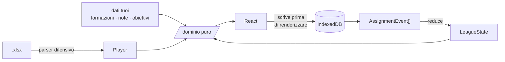

<div align="center">

# ⚽ Fanta Auction Assistant

**La tua vista privata sull'asta del Fantacalcio Classic.**
Non il tabellone della lega — quello che ti dice, nei cinque secondi della chiamata,
se quel giocatore è titolare e se puoi ancora permettertelo.

[](#collaudo)
[](#i-tre-vincoli)
[](#stack)
[](#privacy-e-dati)

</div>

---

> **Versione di fine mercato 2026/27**, aggiornata il 4 settembre 2026, a mercato chiuso.
> Il listone è quello definitivo di Fantacalcio.it: 533 giocatori in lista, 59 fuori lista.
> Fasce e specialisti dei piazzati vengono dalla guida SosFanta, gli infortunati dalla sua
> tabella indisponibili, e si rigenerano con gli script di `scripts/` ogni volta che la fonte
> cambia — è un comando, non una riscrittura.

---

## Il problema

Un'asta Classic sono **300 chiamate in tre ore**. Su ognuna devi decidere in pochi secondi,
e le informazioni che contano non sono sul tabellone: se il giocatore è titolare nella sua
squadra, se l'avevi messo tra gli obiettivi, chi ha ancora i crediti per soffiartelo.

Questa app tiene tutto questo a portata di una riga digitata.

```
dimarco 60 mrc
```

Nome, prezzo, sigla. Invio. L'acquisto è registrato, i crediti scalano, la rosa si aggiorna.

---

## Avvio

```bash
npm install
npm run dev        
```

Alla prima apertura ci sono due cose da fare, in questo ordine:

| | Dove | Cosa |
| :-: | --- | --- |
| **1** | Impostazioni → **Listone** | Carica `lista_calciatori_classic.xlsx` |
| **2** | Impostazioni → **Partecipanti** | Nomi e sigle dei 12, e quale squadra sei tu |

Le sigle sono di tre lettere e sono quello che digiterai all'asta: mettile vere,
`sq2` non è il nome di nessuno.

---

## Le sezioni

### 🔨 Squadre — l'editor delle formazioni

Il collo di bottiglia del progetto: venti squadre da compilare a mano, ed è lavoro che
il giorno dell'asta non recuperi.

Scegli il modulo, premi **Compila dal primo slot vuoto** e batti `Invio` undici volte.
Ogni slot propone **solo i giocatori di quel club**, con in cima i consigliati — quelli
di ruolo compatibile, ordinati per `QUOT.` decrescente: chi gioca sta quasi sempre lì.
Il resto della rosa resta raggiungibile, in qualsiasi slot (vedi sotto).

| Tasto | Effetto |
| --- | --- |
| `Invio` | Assegna e passa allo slot successivo |
| `Maiusc`+`Invio` | Assegna e resta: è così che si crea un **ballottaggio** |
| `Tab` | Mostra tutta la rosa del club, ruoli non compatibili compresi |
| `Esc` | Chiude il picker |
| `Canc` | Svuota lo slot selezionato |

Cambiare modulo conserva tutto ciò che continua a starci, e ti dice chi resta fuori.

> [!TIP]
> **Fuori ruolo — nessuno slot è chiuso.** I giocatori compatibili di ruolo sono solo i
> **consigliati**, quelli che stanno in cima e che la raffica di `Invio` consuma. Sotto
> c'è il resto della rosa del club, qualsiasi ruolo: un difensore a centrocampo, un
> portiere in attacco, quello che serve. Il listone elenca Dimarco ed Estupinán tra i
> difensori, ma nel 3-5-2 giocano esterni nei cinque di centrocampo — il ruolo di
> listino è la lista da cui li compri, non la posizione in cui giocano.
>
> Il resto della rosa compare in due modi, sempre in coda ai consigliati:
> **digitando** un nome, oppure con `Tab` (o il pulsante *tutta la rosa*) per sfogliarla
> tutta quando il nome non te lo ricordi. In formazione quel giocatore porta un bollino
> ambra con la sua lettera di listino, così sai da che lista lo compri.

### 🔴 Asta — la command bar

```
dimarco              cerca
dimarco 60           chi può ancora rilanciare a 60
dimarco 60 mrc       assegna Dimarco a MRC per 60
```

Ogni risultato porta con sé il **badge di formazione** e la prima riga della tua nota,
inline: è l'informazione che serve adesso, e andarla a cercare altrove costa più del
tempo che hai.

```
Dimarco        D   Inter   [TITOLARE]   quot 32   ★obiettivo
  "spinge sempre, rigorista sui piazzati"
```

| Tasto | Effetto |
| --- | --- |
| `↑` `↓` | Scegli fra i risultati |
| `Invio` | Conferma |
| `?` | Scheda del giocatore evidenziato |
| `o` | Obiettivi |
| `s` | Svincolati |
| `t` | **L'asta in numeri** |
| `Esc` | Chiude l'overlay — **il testo digitato resta** |
| `Ctrl`+`Z` | Annulla, anche un'assegnazione che non è l'ultima |
| `Ctrl`+`Shift`+`Z` | Ripristina |

La ricerca è filtrata sul ruolo della fase attiva. Se lì dentro non trova niente allarga
a tutti i ruoli e te lo dice: serve a recuperare la chiamata persa di un reparto già chiuso.

#### Il pannello di assegnazione

Una chiamata vera non va come la barra presuppone. Senti il nome, **cerchi se ti interessa**,
il rilancio sale, e solo alla fine sai a quanto e a chi. Per questo accanto ai risultati c'è
un pannello fisso — non un overlay che copre e va chiuso — che si riempie man mano:

```
┌─ risultati ──────────────────┬─ DIMARCO · D · Inter ────────┐
│ ▸ Dimarco   D Inter [TIT] 32 │  [TITOLARE]  ★ obiettivo     │
│   Dimarco A D Como  [PAN]  5 │  "spinge sempre, rigorista"  │
│                              │  ── Inter · 4-3-3 ──         │
│                              │  POR Sommer    MEZ Barella   │
│                              │  DS  Dimarco ← MED Calhanoglu│
│                              │  ── prezzo ──                │
│                              │      −  [ 60 ]  +            │
│                              │  A 60 possono rilanciare in 4│
│                              │  ── a chi è andato? ──       │
│                              │  [LEO 800] [MRC 740]         │
│                              │  [ANN 612] [SQ4 pieno]          │
└──────────────────────────────┴──────────────────────────────┘
```

I dodici riquadri fanno due lavori insieme: dicono **chi può ancora rilanciare** — con crediti
e tetto massimo, e spenti quando il reparto è pieno o i crediti non bastano — e sono il
**bottone con cui chiudi l'acquisto**. Le sigle non devi ricordarle.

I due modi convivono e si alimentano: se digiti `dimarco 60`, il 60 compare già nel campo
prezzo e ti resta solo da cliccare la squadra quando sai chi ha vinto. Se hai fretta,
`dimarco 60 mrc` + `Invio` fa tutto in una riga come prima.

### 📊 L'asta in numeri — `t`

Tutto misurato, niente stimato. Nessun prezzo **previsto**: il modello della 1.0, che derivava
una cifra dal listone per tutti, è morto con la 1.0 e non torna. L'unico numero in crediti che
l'app propone è il [prezzo dinamico](#-aspettative-e-prezzo-dinamico), e nasce da tutt'altro:
una tua stima scritta a mano, messa in rapporto con quello che il tavolo sta pagando stasera.

| | Risponde a |
| --- | --- |
| **Termometro del tavolo** | Quota di crediti bruciati ÷ quota di slot riempiti. Sopra 1 si sta pagando caro e conviene aspettare, sotto 1 gli affari sono adesso |
| **Ritmo** | Chiamate al minuto, e la fine stimata — l'unica proiezione della schermata, ed è dichiarata |
| **Dove vanno i crediti** | Spesa, medie e colpo più caro reparto per reparto |
| **Che roba è uscita** | Quanti dei giocatori già andati sono **titolari nelle formazioni che hai compilato tu**. È il dato che nessun altro al tavolo ha |
| **Le due classifiche** | Colpi più cari, e chi è stato pagato più sopra la propria `QUOT.` |
| **Squadra per squadra** | Crediti, max bid, **crediti per slot ancora libero** — la potenza di fuoco vera di chi ha 200 crediti e diciotto buchi. Ordinabile da qualsiasi colonna |

### 📋 Svincolati

Chi non è ancora stato assegnato, diviso per ruolo, **ordinato per `QUOT.` decrescente** come
il listone. Ogni riga porta con sé tag e appunto: `★` obiettivo, `◇` alternativa, `⨯` da evitare.
La riga è cliccabile e apre la scheda accanto alla tabella, senza coprirla.

Ordinabile anche per nome, squadra, stato di formazione, fascia, `FVM`. Filtri combinabili su
squadra, tag, stato, fascia, presenza di nota, quotazione minima — e **restano come li lasci**
fra un'apertura e l'altra.

Il **ruolo non è un filtro che si toglie**: `P D C A` sono quattro viste e una è sempre accesa,
non c'è un "tutti". L'asta Classic procede per ruoli in sequenza, e mescolare un portiere da 19
con un attaccante da 38 in un unico elenco ordinato per `QUOT.` darebbe una classifica che
durante la chiamata non serve a niente. Per tornare ai portieri si preme `P`.

---

### 🏷️ Le fasce della guida

Ogni giocatore porta la **fascia della guida all'asta di SosFanta** — da `SUPER TOP` a
`DA EVITARE`, passando per `JOLLY`, `SCOMMESSE`, `LOW COST` — nella scheda giocatore e in una
colonna degli svincolati, che ci si può anche ordinare e filtrare.

Non è un tag: `obiettivo`/`alternativa`/`evita` restano il tuo giudizio e finiscono nel backup,
la fascia è un **dato derivato dal listone** che si ricalcola a ogni import e non occupa spazio
fra i tuoi dati. L'aggancio è per nome normalizzato, perché la guida non pubblica gli id di
Fantacalcio.it: sul listone di fine mercato 2026-27 prende 490 nomi su 492, e chi non aggancia semplicemente
non ha badge.

```bash
node scripts/build-tiers.mjs   # riscarica la guida e rigenera src/data/tiers.ts
```

Lo script muore nominando la pagina se la guida introduce una fascia che `TIER_ORDER` non
conosce o se il markup cambia: meglio nessun aggiornamento che un file monco.

---

### 🩹 Chi è fermo, e fino a quando

La fascia `INFORTUNATI` della guida dice *che* uno è fermo. La **tabella indisponibili** di
SosFanta dice **per quanto**, con la giornata, e lo dice per tutti invece che per gli otto big
che la guida commenta. All'asta è la differenza fra "non prenderlo" e "prendilo a saldo".

Il chip in cima alla scheda porta la cifra su cui si decide — **infortunato · rientro 13a** —
e passandoci sopra, o toccandolo da tablet, si legge il motivo con le parole della fonte:
*"Operato per frattura al quinto metatarso del piede sinistro"*. Un crociato e un affaticamento
non valgono la stessa giornata.

```bash
node scripts/build-injuries.mjs   # riscarica la tabella e rigenera src/data/injuries.ts
```

L'aggancio è **per nome dentro la rosa del club**, come per i piazzati e non come per le fasce:
la tabella pubblica squadra per squadra, quindi il campo si restringe a venticinque uomini
invece di cinquecento. Due omonimi nella stessa rosa non prendono niente, nessuno dei due.

La stessa tabella elenca squalificati e diffidati, che lo script legge e mette nello stesso
file: fuori dal campionato sono vuoti, a stagione in corso no.

---

### 📊 Le statistiche della scorsa stagione

La scheda giocatore mostra come è andata davvero l'anno scorso in Serie A: **fantamedia**,
media voto, presenze, e poi gol, assist e rigori segnati su calciati per chi gioca fuori dai
pali, **porte inviolate**, gol subiti e rigori parati per i portieri. Cartellini per tutti.
La fantamedia compare anche in coda a ogni riga della command bar e del picker delle
formazioni, così durante la chiamata non serve aprire la scheda.

L'aggancio è **per id**: la tabella delle statistiche pubblica lo stesso id di Fantacalcio.it
che il listone mette nella colonna `#`, quindi non c'è nessun nome da normalizzare e nessuna
omonimia da sciogliere. Sul listone di fine mercato 2026-27 aggancia 365 giocatori su 533: i restanti sono
arrivi dall'estero e promossi dalla B, e per loro la scheda dice **"non ha giocato"** invece di
mostrare degli zeri. Sotto le 12 presenze la scheda avvisa che quella fantamedia è un campione
piccolo, non una stagione.

```bash
node scripts/build-stats.mjs   # riscarica le statistiche e rigenera src/data/stats.ts
```

Le porte inviolate non stanno nella tabella di riepilogo: lo script le conta giornata per
giornata sulla pagina di ogni portiere e **verifica che presenze e gol subiti così ottenuti
combacino col riepilogo**, così un cambio di markup non produce numeri plausibili e sbagliati.

Sulla stessa pagina, per tutti i 547 giocatori che hanno preso almeno un voto, si contano le
**partite sufficienti**: le giornate chiuse con voto ≥ 6.5. Una media voto 6,2 fatta di 6,5 e 6
è un'altra cosa dalla stessa media fatta di 7,5 e 5, e la media da sola non lo dice. Per i
cinque che hanno cambiato club a stagione in corso la fonte elenca solo le giornate di un club:
lì il conteggio resta **vuoto** invece di diventare uno zero che direbbe una bugia.

---

### 🏅 Punti di forza e punti deboli

Le stesse cifre di sopra, lette come **posizione dentro il ruolo**. "Media voto 6,17" non dice
niente; "12° tra i difensori" dice tutto, e nei cinque secondi della chiamata è l'unica forma in
cui una statistica serve. La scheda mostra due colonne — fino a tre pregi e fino a tre difetti —
con la cifra, la posizione e una barra che disegna la posizione, non il valore.

Il pool è **tutti i giocatori dello stesso ruolo con almeno una presenza** (196 difensori, 192
centrocampisti, 116 attaccanti, 43 portieri), senza soglie minime, e i pari merito condividono
la posizione come in una classifica sportiva. Non è una convenzione scelta a caso: sono le due
regole che riproducono esattamente i numeri di FantaLAB. Su Hermoso, 2025/26, escono media voto
12°, % partite con voto ≥ 6.5 16° e fantamedia 19° — le tre posizioni pubblicate sulla sua
scheda. C'è un test che lo verifica sui dati veri, in `src/domain/highlights.test.ts`.

Due scelte che tengono onesta la colonna dei difetti:

- **un pregio deve stare sopra la metà del suo ruolo, un difetto sotto.** Prendere sempre le tre
  peggiori metteva "3° negli assist" fra i punti deboli di Dimarco. Chi è forte ovunque ha la
  colonna vuota, ed è il dato giusto;
- **il giudizio non guarda il rank ma la posizione media dei pari merito.** Trenta portieri su
  quarantatré hanno zero rigori parati: sono tutti quindicesimi, e nessuno di loro è bravo a
  parare i rigori.

---

### 🥊 Le statistiche di campo

Anticipi, contrasti vinti, duelli aerei e falli commessi, che Fantacalcio.it non pubblica. La
fonte è **Sofascore**, ed è l'unica gratuita che li dia per la Serie A: risponde 403 a `curl` e
200 a un browser vero, quindi `data/sofascore-2025-26.txt` è quel 200 salvato una volta sola.
Il procedimento per rifarlo — endpoint, campi, paginazione — è nell'intestazione dello script.

```bash
node scripts/build-advanced.mjs   # dump -> src/data/advanced-stats.ts
```

Sofascore non conosce l'id di Fantacalcio.it, quindi qui l'aggancio è **per nome**, e i due lati
lo scrivono in modi opposti: `Esposito Se.` contro `sebastiano-esposito`, e a volte con lo slug
girato (`yildiz-kenan`). Lo script risolve in tre turni — prima chi porta l'abbreviazione, poi i
nomi nudi, infine i resti sulle presenze — e **muore se resta un solo caso ambiguo**: meglio
nessun file che le cifre di un giocatore attaccate al nome di un altro. Aggancia **562 su 562**
di quelli presenti in entrambe le fonti, con due eccezioni dichiarate in chiaro nel codice
(`Ramon`, che Sofascore chiama col secondo cognome; `Djuric`, la cui Đ sparisce dallo slug).

Queste voci si contano **ogni 90 minuti** e non a partita — la presenza di chi entra al 90' non è
l'unità di misura di chi le gioca tutte — e chi sta sotto i 450 minuti non entra in classifica:
tre anticipi in mezz'ora farebbero primo un fantasma. Da qui pool diversi sulla stessa scheda:
196 difensori sulle metriche di rendimento, 162 su quelle di campo. La scheda scrive sempre "su
quanti".

Due scelte di merito: anticipi e contrasti si classificano **solo per difensori e
centrocampisti** (un attaccante ultimo nei contrasti non ha un difetto, ha un altro lavoro), e le
**parate non ci sono** pur essendo nel dato — un portiere para molto anche perché ha una difesa
che gli fa arrivare tutto addosso, e messa fra i pregi direbbe il contrario di quello che sembra.

> **Non sono le stesse cifre di FantaLAB.** Il loro fornitore è un altro e le definizioni non
> coincidono: delle tre voci di campo di Hermoso — anticipi 74°, falli 142°, ammonizioni 146° —
> questi dati ne riproducono una sola. Sono misure vere prese da Sofascore, non un tentativo di
> indovinare i numeri di qualcun altro. Le metriche di rendimento, quelle sì, combaciano esatte.

---

### ⚽ Gli specialisti dei piazzati

Chi calcia i **rigori**, le **punizioni** e i **corner**, squadra per squadra, con la gerarchia
di SosFanta. Il primo rigorista ha un chip acceso in cima alla scheda, accanto allo stato di
formazione: dopo "titolare" è il fatto più pesante che ci sia su un giocatore. Sotto, la sezione
*Piazzati* elenca gli incarichi fino al terzo posto — oltre, la gerarchia è teorica.

Le stesse tre gerarchie stanno anche in **Squadre**, sotto la formazione: lì la domanda non è
"questo che posto ha" ma "di questi undici, chi calcia", ed è l'unico momento in cui si guardano
tutti insieme. I nomi agganciati aprono la scheda con un clic.

**Il podio della squadra** sta sotto il badge: mouse sopra, o dito, e si apre la gerarchia
intera di quel club — chi tira per primo, chi dopo. "Terzo" da solo non dice niente; terzo
dietro a due che non sono più in rosa dice tutto, e infatti i nomi che il listone non ha più
restano in lista, barrati e marcati *fuori rosa*, invece di sparire e far sembrare la gerarchia
più corta di com'è.

```bash
node scripts/build-specialists.mjs   # rigenera src/data/specialists.ts
```

L'aggancio è per nome **dentro la rosa del club**, non sul listone intero: la fonte pubblica le
gerarchie squadra per squadra, e venticinque candidati invece di cinquecento rendono il match
per nome più sicuro di quello delle fasce. Se dentro la stessa rosa due giocatori condividono il
cognome — la fonte scrive "Martinez", in casa Inter ce ne sono due — **nessuno dei due** prende
il badge.

Le punizioni e i corner sulla fonte sono elenchi ordinati, i rigoristi no: sono raccontati a
parole. Per quelli lo script legge la rosa del club dal listone e cerca quali giocatori il testo
cita, distinguendo il paragrafo *Primo* dalle *Note* — ed è il motivo per cui questo script,
unico dei tre, va lanciato **dopo** aver aggiornato `data/lista_calciatori_classic.xlsx`.
Stampa le sessanta righe di quello che ha capito prima di scrivere il file: un parser di prosa
si verifica leggendolo.

### 🗓️ La griglia di alternanza

Il calendario di Serie A visto dal fantacalcio: **venti righe, trentotto colonne**, ogni casella
è l'avversario di quella giornata colorato per quanto è duro affrontarlo. `INT` maiuscolo è in
casa, `int` minuscolo è fuori.

Serve a una domanda sola, quella per cui si compra il secondo portiere: *se accoppio queste due
squadre, quante giornate comode mi restano?* Clicchi due righe — fino a quattro — e in cima
compare l'abbinamento: **voto su 100**, facili, medie, difficili, quante in casa e quante fuori.
Ogni giornata l'anello bianco segna la partita che schiereresti davvero, cioè la più comoda fra
quelle scelte. Il pulsante **Attaccanti** guarda le stesse partite dall'altra parte: il colore
non è lo stesso, perché una difesa molle e un attacco molle non sono la stessa squadra —
l'Udinese è *media* per un portiere e *facile* per un attaccante.

Sopra la griglia stanno i **migliori abbinamenti** — le tre coppie e le due terne migliori
possibili sull'intervallo di giornate scelto, calcolate per intero e non a campione: 190 coppie
e 1140 terne sono poche abbastanza perché l'esaustivo costi meno di qualunque scorciatoia. Un
click le carica. L'intervallo parte dalla prima giornata **ancora da giocare**, e i preset
`prossime 5` e `prossime 10` sono la finestra in cui una scelta di formazione ha senso: sulle
38 giornate intere tutte le squadre si equivalgono, perché tutte affrontano tutte.

**I colori sono quelli di FantaLab**, non una stima di questo progetto: stanno in
`src/data/difficulty.ts`, una riga per club con la colonna portieri e quella attaccanti. Sono
stati letti dalla loro griglia incrociando la riga della Juventus con il calendario, casella per
casella; le due occorrenze di ogni club — andata e ritorno, casa e fuori — hanno sempre lo stesso
colore, quindi **la difficoltà non dipende dal campo**. La tabella si aggiorna a mano ed è
l'unico posto da toccare se un giudizio cambia.

Il **voto** è `100 − peso medio`, contando 0 una partita facile, 50 una media e 100 una
difficile. È il conto di FantaLab, e i test lo ancorano ai loro numeri: Genoa + Udinese sulle 38
giornate fa 87, Frosinone + Genoa dalla 3ª fa 86, Genoa + Parma + Udinese fa 99, Atalanta +
Bologna fa 83 con 26 facili, 11 medie e 1 difficile. Sono gli stessi valori che stampa la loro
griglia.

> Resta una differenza, ed è solo cosmetica: **quante in casa e quante fuori**. Quando le squadre
> di un abbinamento hanno lo stesso colore nella stessa giornata — un terzo delle giornate, i
> colori sono tre — bisogna decidere quale delle due "giocheresti", e quella scelta non cambia la
> difficoltà ma sposta il conto casa/fuori. Qui vince il club che hai scelto per primo.
>
> FantaLab fa lo stesso in **22 pareggi su 25** misurati su due abbinamenti; nei tre restanti
> sceglie l'altro, e la loro regola non è ricostruibile perché si contraddice: sulla stessa coppia
> di partite (Torino fuori contro Genoa in casa) in un abbinamento vince l'una e in un altro
> l'altra. Non è il fattore campo, non è l'alternanza dei due portieri, non è l'orario — i turni
> futuri sono tutti alle 15:00 — e non è la forza delle rose. Il risultato è **una unità di
> scarto** sul riquadro casa/fuori: 20 contro 21 su Atalanta + Bologna, 18 contro 19 su
> Udinese + Genoa + Parma. Facili, medie, difficili e voto restano identici.

```bash
node scripts/build-calendar.mjs   # rigenera src/data/calendar.ts
```

Le partite sono il calendario ufficiale di Fantacalcio.it, verificato prima di essere scritto:
dieci partite per giornata, nessuna squadra due volte nello stesso turno, diciannove in casa e
diciannove fuori per tutti, e i **nomi dei club uguali a quelli del listone** — se il calendario
dicesse "Hellas Verona" dove il listone dice "Verona", lo script muore invece di produrre una
griglia con un buco. Un club che il calendario ha e la tabella dei colori no non viene
indovinato: la griglia lo salta e lo dice.

### 🎯 Obiettivi

Strategia in markdown semplice (titoli, elenchi, **grassetto**, *corsivo*, `codice`) e lista
dei target con priorità riordinabile. Ogni riga dice se il giocatore è ancora libero o già
andato, e a chi.

---

### 💰 Aspettative e prezzo dinamico

Risponde a una domanda sola, quella che sotto asta non ci si ricorda di farsi:

> *Se penso che Yildiz faccia gli stessi numeri di Kolo Muani, e Kolo Muani è appena andato
> a 60, perché sto scrivendo 90?*

Scrivi per ogni giocatore che ti interessa quanto pensi che faccia quest'anno — presenze, gol,
assist, ammonizioni, espulsioni — e durante l'asta accanto al suo nome compare un **prezzo
consigliato che si muove a ogni martellata**.

```
V(x)         = w[ruolo] × presenze + 3×gol + 1×assist − 0,5×amm − 1×esp
tasso[ruolo] = mediana( prezzo_pagato ÷ V )  sulle aste già battute del reparto
prezzo(x)    = tasso[ruolo] × V(x)
```

Nessuno dei due lati è una previsione dell'app: `V` è la **tua** stima dichiarata, il tasso è
quello che il **tuo** tavolo sta pagando stasera. Se non hai scritto l'aspettativa, il prezzo non
esiste — ed è il caso normale.

**Il peso delle presenze cambia per reparto** (`D 0,5 · C 0,3 · A 0,2`): da un difensore compri
titolarità, da un attaccante gol. Non è una preferenza, è misurato — sui difensori peso 0 dà il
42% di errore e peso 0,3 il 29%, sugli attaccanti da 0 a 2 l'errore non si muove.

Si compila in due posti: la sezione **Aspettative** — una riga per giocatore, `Tab` che scorre le
cinque caselle, `FVM` decrescente — per riempirne quaranta la sera prima, e la scheda giocatore
per il ripensamento sul singolo nome. In entrambe un bottone precompila con le cifre **vere**
della scorsa stagione; da lì in poi il numero è tuo. Svuotare tutte le caselle **toglie** la
riga invece di metterla a zero: "non farà niente" è un giudizio, "non l'ho valutato" è un'altra
cosa e spegne il prezzo invece di falsarlo.

> [!NOTE]
> **Ogni reparto sta per conto suo, e non si prestano niente.** La simulazione misura 0,96
> crediti per punto sui difensori e 1,90 sugli attaccanti: prestare il tasso dei D alla fase A
> dimezzerebbe ogni consiglio, e proprio all'apertura del reparto, quando escono i nomi grossi.
> Il prezzo di conseguenza. I primi **tre colpi di ogni fase non hanno consigliato**, e la
> schermata lo dice a parole invece di mostrare un trattino.

#### Quanto ci si può fidare

`src/test/valuation-sim.test.ts` simula un'asta intera su 264 giocatori di movimento, e non bara:
le aspettative sono le statistiche **vere** 2025/26, i prezzi escono dalla colonna `FVM/1000`
riscalata sui 9.600 crediti. Due sorgenti indipendenti, nessuna prodotta da questa formula.

```bash
SIM=1 npx vitest run valuation-sim
```

| Scenario | Errore mediano |
| --- | --- |
| Aspettative perfette | **0,0%** — il meccanismo è corretto, l'errore sta altrove |
| Statistiche dell'anno scorso come aspettative | **40%** |

**Il collo di bottiglia sono le aspettative, non la formula.** Curvarla con un esponente
(`tasso × V^γ`) non migliora niente: 39% a γ=1, 43% a γ=2. Riduce solo il bias sistematico, e
quindi la formula resta lineare — complicarla non paga, e questo è misurato invece che opinato.

Quel 40% è il tetto pessimistico, e viene in gran parte dal fatto che *l'anno scorso* non è
*quest'anno*: stesse cifre 2025/26 per Malen e Hojlund, prezzi veri 348 e 201. Le aspettative
scritte a mano sono il rimedio, ed è per quello che le scrivi tu.

> [!WARNING]
> **Sui nomi più cari il consigliato è sistematicamente basso** — bias −33% sul terzo più
> costoso, +63% sul terzo più economico. È per costruzione: la proporzione pura non cattura il
> fatto che il mercato paga i top più che proporzionalmente. Leggilo come un pavimento, non come
> un tetto.

#### Si può spegnere

Un interruttore in **Impostazioni → Prezzo dinamico** toglie tutto: sparisce la sezione
Aspettative, la sezione nella scheda giocatore e il consigliato nel pannello d'asta. L'app torna
esattamente com'era prima della feature.

**Non cancella niente.** Le aspettative restano su disco e nel backup, e riaccendendo si ritrova
ogni riga dov'era, anche a metà asta. Per questo non chiede conferma: non c'è niente da perdere,
e una conferma su un gesto reversibile insegna solo a cliccare "sì" senza leggere.

Esiste perché l'asta è una serata sola e non si ripete: se il numero distraesse invece di
aiutare, non ci deve essere modo di restare impantanati.

---

### ✅ Sei pronto? — la checklist pre-asta

In cima alle **Impostazioni**, sei pallini e una riga. Il lavoro di questo progetto non si perde
per un errore: si perde per un'omissione — tre club senza formazione fra i venti non si notano
finché non te ne chiamano uno.

Listone · partecipanti e sigle · **club senza formazione, elencati per nome** · obiettivi senza
nota · appunti · età dell'ultimo backup. Ogni voce ha il suo numero e cosa fare adesso; gli
avvisi non bloccano, le cose mancanti sì.

---

## Privacy e dati

Tutto vive nel **tuo browser**, in IndexedDB. Nessun backend, nessuna chiamata di rete a
runtime, nessun account. Il giorno dell'asta l'app funziona anche senza connessione.

> [!WARNING]
> **Il backup è il rischio numero uno del progetto.** Una pulizia dati del browser azzera
> tutto senza preavviso: venti formazioni sono giorni di lavoro, e le aspettative una serata.
> Scarica un `.json` da **Impostazioni → Backup** ogni volta che finisci di lavorare.

All'apertura l'app ne scarica uno da sola se l'ultimo risale a più di un giorno — ma è una
rete di sicurezza, non un posto su cui appoggiarsi.

L'import di un backup è **non distruttivo** e passa da una conferma che mostra cosa entra,
cosa viene saltato perché più vecchio di quello che hai già, e quali eventi verranno scartati.
A parità di chiave vince il record più recente, mai il file.

---

## Export

| Formato | A cosa serve |
| --- | --- |
| **`.xlsx` nativo** | Il listone con `FantaSquadra` e `Costo` compilate, reimportabile in Lega Fantacalcio |
| **`.xlsx` report** | Rose, spesa per reparto, totali di lega |
| **`.pdf`** | Riepilogo stampabile delle 12 rose |
| **`.json`** | Backup completo dei dati utente |

L'export nativo **riscrive dentro il file originale** invece di rigenerarlo: le 592 righe e
le colonne che l'app non usa devono sopravvivere intatte, perché *"reimportabile"* non ammette
il quasi.

---

## Re-import del listone

Il mercato chiude il 1° settembre e il listone va riscaricato — questa versione monta già quello
definitivo, ma il flusso resta lo stesso a ogni futuro aggiornamento. Il diff — nuovi, usciti, cambio
squadra, quotazione variata oltre ±20% — **si mostra sempre prima di applicarlo**, insieme a
cosa ti costa: quali giocatori su cui avevi lavorato escono dalla Serie A, quali formazioni
perdono qualcuno, quanti slot restano vuoti.

- Le note dei giocatori usciti si **archiviano**, non si cancellano: uno può rientrare, e una
  cancellazione è irrecuperabile
- Il re-import è **bloccato** se ci sono assegnazioni attive — cambiare il listone ad asta
  iniziata invaliderebbe l'event log
- Per sbloccarlo c'è *Annulla tutte le assegnazioni*, che resta un soft delete: gli eventi
  restano nel log e si ripristinano uno per uno

`data/listone-prova-reimport.xlsx` è un listone modificato ad arte per provare il flusso senza
aspettare settembre.

---

## Architettura

```
src/
├── domain/      logica pura — reducer, formazioni, ricerca, statistiche, checklist, backup
├── parse/       parser difensivo del listone .xlsx
├── data/        fasce SosFanta, statistiche e calendario Fantacalcio.it, generate da scripts/
├── store/       Zustand + Dexie
├── features/    live · teams · free · grid · expectations · goals · player · settings
└── export/      xlsx nativo · report · pdf
```



### I tre vincoli

**1. `/src/domain` è puro.** Non importa React, non importa Zustand, non tocca IndexedDB.
La suite ne copre il **100% dei branch**, ed è una soglia che fa fallire `npm run test:cov` —
non un obiettivo morale.

**2. Lo stato di lega è sempre `reduce(events, config)`.** Rose, crediti e slot non si mutano
mai a mano. Nessun hard delete: annullare è `undone: true`, e per questo si può annullare
un'assegnazione che non è l'ultima e ripristinarla dopo.

**3. Si scrive prima di renderizzare.** Ogni azione attende la scrittura su IndexedDB e solo
dopo aggiorna la vista, così un crash a metà asta non perde l'acquisto appena battuto.
L'unica deroga è dichiarata e commentata: l'editor formazioni, dove il render segue un ref
sincrono per non perdere tasti sotto una raffica di `Invio`.

Tutte le scritture passano da **una coda unica**. Senza, due modifiche ravvicinate
partirebbero dallo stesso stato e l'ultima cancellerebbe la prima — è il bug che è uscito due
volte, ed è il motivo per cui lo store ha i suoi test.

---

## Collaudo

```bash
npm test              # 704 test
npm run test:cov      # con copertura; /src/domain ha soglia 100%
npm run build
```

I test girano sul **listone vero**, non su fixture inventate: 533 giocatori, distribuzione
P 65 / D 189 / C 192 / A 87. Il replay simula un'asta completa da 300 assegnazioni e verifica
che ne escano 12 rose da 25.

C'è anche una guardia sul costo a fine asta — con 300 eventi la piega dell'event log sta in
**~18 ms** e una battuta sulla command bar in **~0,2 ms** — tarata larga di proposito: serve a
intercettare una regressione algoritmica, non a misurare la macchina.

---

## Stack

`Vite` · `React 18` · `TypeScript strict` · `Tailwind` · `Zustand` · `Dexie` · `SheetJS` ·
`pdfmake` · `Vitest`

Niente `any`, niente `@ts-ignore`, `noUncheckedIndexedAccess` e `exactOptionalPropertyTypes`
attivi.

> Fuse.js è fra le dipendenze ma **non è usato**: la ricerca ha un matching a gradini
> espliciti in `domain/search.ts`. Sotto asta conta che lo stesso prefisso dia sempre lo
> stesso primo risultato, e che si possa spiegare in una riga perché.

---

<div align="center">
<sub>Specifica di riferimento: <a href="./PRD-asta-fantacalcio-v2.md"><code>PRD-asta-fantacalcio-v2.md</code></a><br/>
La 1.0 resta in <code>PRD-v1-superseded.md</code> come riferimento storico.</sub>
</div>
