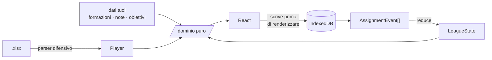

<div align="center">

# ⚽ Fanta Auction Assistant

**La tua vista privata sull'asta del Fantacalcio Classic.**
Non il tabellone della lega — quello che ti dice, nei cinque secondi della chiamata,
se quel giocatore è titolare e se puoi ancora permettertelo.

[](#collaudo)
[](#i-tre-vincoli)
[](#stack)
[](#privacy-e-dati)

</div>

---

## Il problema

Un'asta Classic sono **300 chiamate in tre ore**. Su ognuna devi decidere in pochi secondi,
e le informazioni che contano non sono sul tabellone: se il giocatore è titolare nella sua
squadra, se l'avevi messo tra gli obiettivi, chi ha ancora i crediti per soffiartelo.

Questa app tiene tutto questo a portata di una riga digitata.

```
dimarco 60 mrc
```

Nome, prezzo, sigla. Invio. L'acquisto è registrato, i crediti scalano, la rosa si aggiorna.

> [!NOTE]
> La versione 1.0 costruiva un modello di prezzo — quotazioni normalizzate, ricalibrazione
> live, soglie di rilancio. **È stato eliminato per intero**: i prezzi variano troppo tra un
> tavolo e l'altro perché una previsione derivata dal listone sia affidabile, e la precisione
> che produceva era illusoria. Il valore si è spostato sulle informazioni che inserisci tu.

---

## Avvio

```bash
npm install
npm run dev          # → http://localhost:5173
```

Alla prima apertura ci sono due cose da fare, in questo ordine:

| | Dove | Cosa |
| :-: | --- | --- |
| **1** | Impostazioni → **Listone** | Carica `lista_calciatori_classic.xlsx` |
| **2** | Impostazioni → **Partecipanti** | Nomi e sigle dei 12, e quale squadra sei tu |

Le sigle sono di tre lettere e sono quello che digiterai all'asta: mettile vere,
`sq2` non è il nome di nessuno.

---

## Le quattro sezioni

### 🔨 Squadre — l'editor delle formazioni

Il collo di bottiglia del progetto: venti squadre da compilare a mano, ed è lavoro che
il giorno dell'asta non recuperi.

Scegli il modulo, premi **Compila dal primo slot vuoto** e batti `Invio` undici volte.
Ogni slot propone **solo i giocatori di quel club**, già filtrati per ruolo compatibile
e ordinati per `QUOT.` decrescente — chi gioca sta quasi sempre in cima.

| Tasto | Effetto |
| --- | --- |
| `Invio` | Assegna e passa allo slot successivo |
| `Maiusc`+`Invio` | Assegna e resta: è così che si crea un **ballottaggio** |
| `Esc` | Chiude il picker |
| `Canc` | Svuota lo slot selezionato |

Cambiare modulo conserva tutto ciò che continua a starci, e ti dice chi resta fuori.

### 🔴 Asta — la command bar

```
dimarco              cerca
dimarco 60           chi può ancora rilanciare a 60
dimarco 60 mrc       assegna Dimarco a MRC per 60
```

Ogni risultato porta con sé il **badge di formazione** e la prima riga della tua nota,
inline: è l'informazione che serve adesso, e andarla a cercare altrove costa più del
tempo che hai.

```
Dimarco        D   Inter   [TITOLARE]   quot 32   ★obiettivo
  "spinge sempre, rigorista sui piazzati"
```

| Tasto | Effetto |
| --- | --- |
| `↑` `↓` | Scegli fra i risultati |
| `Invio` | Conferma |
| `?` | Scheda del giocatore evidenziato |
| `o` | Obiettivi |
| `s` | Svincolati |
| `Esc` | Chiude l'overlay — **il testo digitato resta** |
| `Ctrl`+`Z` | Annulla, anche un'assegnazione che non è l'ultima |
| `Ctrl`+`Shift`+`Z` | Ripristina |

La ricerca è filtrata sul ruolo della fase attiva. Se lì dentro non trova niente allarga
a tutti i ruoli e te lo dice: serve a recuperare la chiamata persa di un reparto già chiuso.

#### Il pannello di assegnazione

Una chiamata vera non va come la barra presuppone. Senti il nome, **cerchi se ti interessa**,
il rilancio sale, e solo alla fine sai a quanto e a chi. Per questo accanto ai risultati c'è
un pannello fisso — non un overlay che copre e va chiuso — che si riempie man mano:

```
┌─ risultati ──────────────────┬─ DIMARCO · D · Inter ────────┐
│ ▸ Dimarco   D Inter [TIT] 32 │  [TITOLARE]  ★ obiettivo     │
│   Dimarco A D Como  [PAN]  5 │  "spinge sempre, rigorista"  │
│                              │  ── Inter · 4-3-3 ──         │
│                              │  POR Sommer    MEZ Barella   │
│                              │  DS  Dimarco ← MED Calhanoglu│
│                              │  ── prezzo ──                │
│                              │      −  [ 60 ]  +            │
│                              │  A 60 possono rilanciare in 4│
│                              │  ── a chi è andato? ──       │
│                              │  [LEO 800] [MRC 740]         │
│                              │  [ANN 612] [SQ4 pieno]          │
└──────────────────────────────┴──────────────────────────────┘
```

I dodici riquadri fanno due lavori insieme: dicono **chi può ancora rilanciare** — con crediti
e tetto massimo, e spenti quando il reparto è pieno o i crediti non bastano — e sono il
**bottone con cui chiudi l'acquisto**. Le sigle non devi ricordarle.

I due modi convivono e si alimentano: se digiti `dimarco 60`, il 60 compare già nel campo
prezzo e ti resta solo da cliccare la squadra quando sai chi ha vinto. Se hai fretta,
`dimarco 60 mrc` + `Invio` fa tutto in una riga come prima.

### 📋 Svincolati

Chi non è ancora stato assegnato, diviso per ruolo. Ordinabile per nome, squadra, stato di
formazione, `QUOT.`, `FVM`. Filtri combinabili su squadra, tag, stato, presenza di nota,
quotazione minima — e **restano come li lasci** fra un'apertura e l'altra.

### 🎯 Obiettivi

Strategia in markdown semplice (titoli, elenchi, **grassetto**, *corsivo*, `codice`) e lista
dei target con priorità riordinabile. Ogni riga dice se il giocatore è ancora libero o già
andato, e a chi.

---

## Privacy e dati

Tutto vive nel **tuo browser**, in IndexedDB. Nessun backend, nessuna chiamata di rete a
runtime, nessun account. Il giorno dell'asta l'app funziona anche senza connessione.

> [!WARNING]
> **Il backup è il rischio numero uno del progetto.** Una pulizia dati del browser azzera
> tutto senza preavviso: venti formazioni sono giorni di lavoro.
> Scarica un `.json` da **Impostazioni → Backup** ogni volta che finisci di lavorare.

All'apertura l'app ne scarica uno da sola se l'ultimo risale a più di un giorno — ma è una
rete di sicurezza, non un posto su cui appoggiarsi.

L'import di un backup è **non distruttivo** e passa da una conferma che mostra cosa entra,
cosa viene saltato perché più vecchio di quello che hai già, e quali eventi verranno scartati.
A parità di chiave vince il record più recente, mai il file.

---

## Export

| Formato | A cosa serve |
| --- | --- |
| **`.xlsx` nativo** | Il listone con `FantaSquadra` e `Costo` compilate, reimportabile in Lega Fantacalcio |
| **`.xlsx` report** | Rose, spesa per reparto, totali di lega |
| **`.pdf`** | Riepilogo stampabile delle 12 rose |
| **`.json`** | Backup completo dei dati utente |

L'export nativo **riscrive dentro il file originale** invece di rigenerarlo: le 537 righe e
le colonne che l'app non usa devono sopravvivere intatte, perché *"reimportabile"* non ammette
il quasi.

---

## Re-import del listone

Il mercato chiude il 1° settembre e il listone va riscaricato. Il diff — nuovi, usciti, cambio
squadra, quotazione variata oltre ±20% — **si mostra sempre prima di applicarlo**, insieme a
cosa ti costa: quali giocatori su cui avevi lavorato escono dalla Serie A, quali formazioni
perdono qualcuno, quanti slot restano vuoti.

- Le note dei giocatori usciti si **archiviano**, non si cancellano: uno può rientrare, e una
  cancellazione è irrecuperabile
- Il re-import è **bloccato** se ci sono assegnazioni attive — cambiare il listone ad asta
  iniziata invaliderebbe l'event log
- Per sbloccarlo c'è *Annulla tutte le assegnazioni*, che resta un soft delete: gli eventi
  restano nel log e si ripristinano uno per uno

`data/listone-prova-reimport.xlsx` è un listone modificato ad arte per provare il flusso senza
aspettare settembre.

---

## Architettura

```
src/
├── domain/      logica pura — reducer, formazioni, ricerca, backup, diff, markdown
├── parse/       parser difensivo del listone .xlsx
├── store/       Zustand + Dexie
├── features/    live · teams · free · goals · player · settings
└── export/      xlsx nativo · report · pdf
```



### I tre vincoli

**1. `/src/domain` è puro.** Non importa React, non importa Zustand, non tocca IndexedDB.
La suite ne copre il **100% dei branch**, ed è una soglia che fa fallire `npm run test:cov` —
non un obiettivo morale.

**2. Lo stato di lega è sempre `reduce(events, config)`.** Rose, crediti e slot non si mutano
mai a mano. Nessun hard delete: annullare è `undone: true`, e per questo si può annullare
un'assegnazione che non è l'ultima e ripristinarla dopo.

**3. Si scrive prima di renderizzare.** Ogni azione attende la scrittura su IndexedDB e solo
dopo aggiorna la vista, così un crash a metà asta non perde l'acquisto appena battuto.
L'unica deroga è dichiarata e commentata: l'editor formazioni, dove il render segue un ref
sincrono per non perdere tasti sotto una raffica di `Invio`.

Tutte le scritture passano da **una coda unica**. Senza, due modifiche ravvicinate
partirebbero dallo stesso stato e l'ultima cancellerebbe la prima — è il bug che è uscito due
volte, ed è il motivo per cui lo store ha i suoi test.

---

## Collaudo

```bash
npm test              # 478 test
npm run test:cov      # con copertura; /src/domain ha soglia 100%
npm run build
```

I test girano sul **listone vero**, non su fixture inventate: 516 giocatori, distribuzione
P 63 / D 181 / C 184 / A 88. Il replay simula un'asta completa da 300 assegnazioni e verifica
che ne escano 12 rose da 25.

C'è anche una guardia sul costo a fine asta — con 300 eventi la piega dell'event log sta in
**~18 ms** e una battuta sulla command bar in **~0,2 ms** — tarata larga di proposito: serve a
intercettare una regressione algoritmica, non a misurare la macchina.

---

## Stack

`Vite` · `React 18` · `TypeScript strict` · `Tailwind` · `Zustand` · `Dexie` · `SheetJS` ·
`pdfmake` · `Vitest`

Niente `any`, niente `@ts-ignore`, `noUncheckedIndexedAccess` e `exactOptionalPropertyTypes`
attivi.

> Fuse.js è fra le dipendenze ma **non è usato**: la ricerca ha un matching a gradini
> espliciti in `domain/search.ts`. Sotto asta conta che lo stesso prefisso dia sempre lo
> stesso primo risultato, e che si possa spiegare in una riga perché.

---

<div align="center">
<sub>Specifica di riferimento: <a href="./PRD-asta-fantacalcio-v2.md"><code>PRD-asta-fantacalcio-v2.md</code></a><br/>
La 1.0 resta in <code>PRD-v1-superseded.md</code> come riferimento storico.</sub>
</div>
